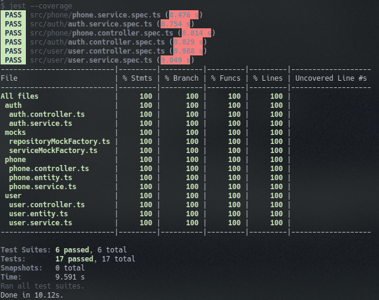

## Phone CRUD Rest API with Nest

### Requirements
- Docker
- docker-compose

### Technologies
- NestJS
- JWT
- Postgres
- Nginx
- Docker

### Designs
- Service pattern
- Repository pattern
- TDD
- Dependency injection
- DTO
- Git flow
- Semantic versioning
- Conventional commits

### Mounting dev environment
1. Install packages using _yarn_ or _npm_:
```shell
yarn install
```
```shell
npm install
```
2. On first time, to download images and build containers:
```shell
docker-compose up --build
```
**for detached build or initialization use `-d` flag**
```shell
docker-compose up --build -d
```
```shell
docker-compose up -d
```
3. To stop containers use:
```shell
docker-compose down
```
4. To stop containers and remove volumes use:
```shell
docker-compose down -v
```
Há uma boa cobertura de código com testes unitários e integração. _Coverage_:


```text
Este projeto está longe do pronto. Alguns pontos a melhorar:
- _exception handling_
- Documentação da _API_ (usando _swagger_ por exemplo)
- Conexão com o outro cliente (Macapá), adicionando mais uma conexão ao _root module_, vinculando na entidade _phone_
e adicionando mais uma rota com o nome do cliente (_tenant_) diferenciando-os. Houve falta de entendimento da minha
parte quantos ao requisito, acreditando ser a implementação para um **ou** para outro cliente, nesse momento (03:34 am)
que percebi estar enganado.
```
**obs.: há um arquivo _json_ na raíz do projeto. Ele pode ser lido pelo _Postman_. Isso para facilitar as coisas já que
não fiz a documentação de projeto**
